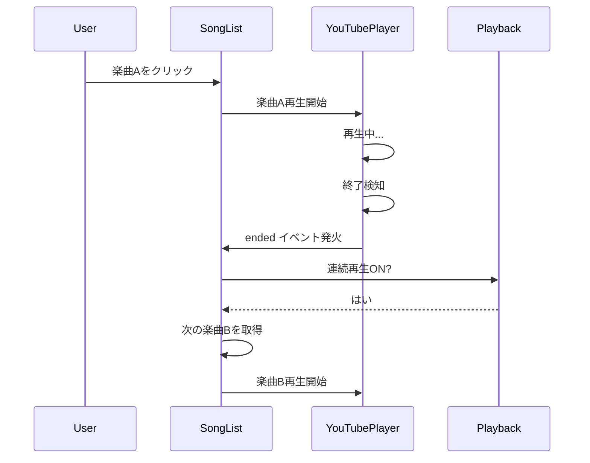
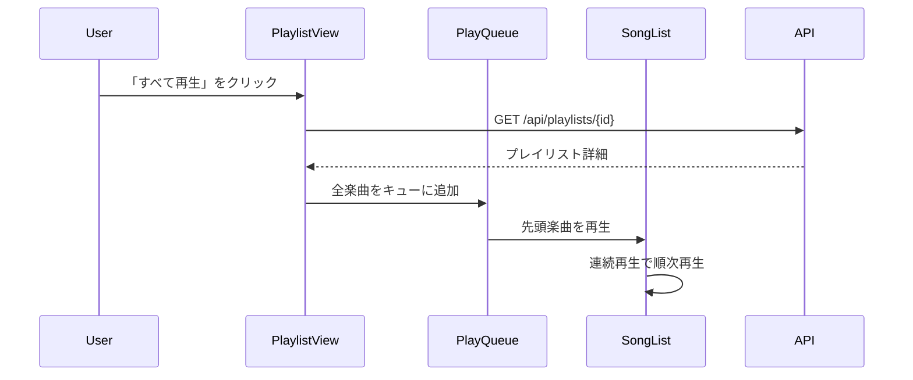

# 連続再生・プレイリスト再生機能 仕様書

**作成日**: 2026-01-27  
**プロジェクト**: VMusicPlayer  
**機能**: 連続再生、再生キュー、プレイリスト管理

---

## 📋 概要

VMusicPlayerに連続再生機能とプレイリスト機能を追加し、より快適な音楽視聴体験を提供する。

### 主要機能

1. **連続再生** - 楽曲リストから自動的に次の曲を再生
2. **再生キュー** - フロントエンド側で管理される一時的な再生順序
3. **プレイリスト** - サーバー側に保存される楽曲コレクション

---

## 🎯 機能要件

### 1. 連続再生機能

#### 1.1 基本動作

**概要**  
現在再生中の楽曲が終了したら、自動的に次の楽曲を再生する機能。

**トグル設定**
- ON/OFF切り替え可能
- 設定はローカルストレージに保存
- デフォルト: OFF

**再生順序**
- 現在表示されている楽曲リストの順序に従う
- 検索結果がアクティブな場合は検索結果内で連続再生
- プレイリスト表示中はプレイリスト内で連続再生

**動作フロー**
```
1. 楽曲A再生中
2. 楽曲Aが終了（end_timeに到達）
3. 連続再生がONの場合
   ├─ リスト内の次の楽曲を検索
   ├─ 次の楽曲が存在する場合 → 自動再生
   └─ 次の楽曲が存在しない場合 → 再生停止
4. 連続再生がOFFの場合
   └─ 再生停止
```

#### 1.2 UI要素

**連続再生トグルボタン**
- 位置: プレイヤーセクション下部
- 表示:
  - ON時: 🔁 連続再生 ON（緑色）
  - OFF時: 🔁 連続再生 OFF（グレー）
- 機能: クリックでON/OFF切り替え

**再生中インジケーター**
- 現在再生中の楽曲をハイライト表示
- 次に再生される楽曲にバッジ表示（連続再生ON時）

#### 1.3 ユースケース

**UC-1: 通常リストでの連続再生**
```
前提条件: 楽曲リスト表示中、連続再生ON
1. ユーザーが楽曲Aをクリック → 再生開始
2. 楽曲A終了 → リスト内の次の楽曲Bが自動再生
3. 楽曲B終了 → リスト内の次の楽曲Cが自動再生
4. 最後の楽曲終了 → 再生停止
```

**UC-2: 検索結果での連続再生**
```
前提条件: 検索実行済み、連続再生ON
1. 検索結果から楽曲Xをクリック → 再生開始
2. 楽曲X終了 → 検索結果内の次の楽曲Yが自動再生
3. （検索結果の範囲内でのみ連続再生）
```

---

### 2. 再生キュー機能

#### 2.1 基本動作

**概要**  
フロントエンド側で管理される、一時的な再生順序リスト。ページリロードで消失する。

**特徴**
- セッション単位（ブラウザメモリ上）で管理
- サーバーへの保存なし
- 楽曲の追加・削除・並び替えが可能
- 連続再生機能と連動

**データ構造**
```typescript
interface PlayQueue {
  songs: Song[]           // 再生キューに含まれる楽曲
  currentIndex: number    // 現在再生中のインデックス
}
```

#### 2.2 UI要素

**再生キューパネル**
- 位置: プレイリストセクション下部またはタブ切り替え
- 表示内容:
  - キュー内の楽曲リスト
  - 現在再生中の楽曲をハイライト
  - 次に再生される楽曲のプレビュー
  - 楽曲数カウンター（例: "再生キュー 5曲"）

**操作ボタン**
- 「キューに追加」ボタン: 各楽曲アイテムに表示
- 「キューをクリア」ボタン: すべての楽曲を削除
- ドラッグ&ドロップ: 再生順序の入れ替え
- 削除ボタン: 個別の楽曲を削除

#### 2.3 操作フロー

**キューへの追加**
```
1. 楽曲リストで楽曲の「+」ボタンをクリック
2. 再生キューの末尾に楽曲を追加
3. 通知表示: "「楽曲名」をキューに追加しました"
```

**キューからの再生**
```
1. 再生キューパネルを開く
2. キュー内の楽曲をクリック
3. その楽曲から再生開始
4. 連続再生ONの場合、キュー内の次の楽曲へ自動遷移
```

**並び替え**
```
1. キュー内の楽曲をドラッグ
2. 目的の位置にドロップ
3. 再生順序が更新される
```

#### 2.4 ユースケース

**UC-3: カスタム再生順序の作成**
```
1. ユーザーが楽曲A、C、Bの順で「+」ボタンをクリック
2. 再生キューに [A, C, B] の順で追加される
3. 再生開始 → A → C → B の順で再生
```

**UC-4: リアルタイムなキュー編集**
```
1. 再生キュー: [A, B, C, D]
2. 現在Bを再生中
3. ユーザーがCを削除 → キュー: [A, B, D]
4. B終了後、Dが再生される
```

---

### 3. プレイリスト機能

#### 3.1 基本動作

**概要**  
サーバー側に永続化される楽曲コレクション。作成・編集・削除が可能。

**特徴**
- データベースに保存（`playlists`、`playlist_songs`テーブル）
- 複数のプレイリスト作成可能
- 楽曲の順序管理（`position`フィールド）
- 再生キューへの一括追加が可能

**既存DBスキーマ（再確認）**
```sql
-- プレイリスト
CREATE TABLE playlists (
    id SERIAL PRIMARY KEY,
    public_id TEXT UNIQUE NOT NULL,
    name TEXT NOT NULL,
    created_at TIMESTAMP NOT NULL DEFAULT CURRENT_TIMESTAMP,
    updated_at TIMESTAMP NOT NULL DEFAULT CURRENT_TIMESTAMP
);

-- プレイリストと楽曲の関連
CREATE TABLE playlist_songs (
    playlist_id INTEGER NOT NULL REFERENCES playlists(id) ON DELETE CASCADE,
    song_id INTEGER NOT NULL REFERENCES songs(id) ON DELETE CASCADE,
    position INTEGER NOT NULL,
    created_at TIMESTAMP NOT NULL DEFAULT CURRENT_TIMESTAMP,
    PRIMARY KEY (playlist_id, song_id),
    CONSTRAINT check_position_positive CHECK (position > 0),
    UNIQUE (playlist_id, position)
);
```

#### 3.2 UI要素

**プレイリスト一覧**
- 位置: プレイリストセクション内のタブ
- 表示内容:
  - プレイリスト名
  - 楽曲数
  - 作成日時
  - サムネイル（最初の楽曲のサムネイル）

**プレイリスト詳細**
- プレイリスト名編集
- 楽曲リスト（並び替え可能）
- 操作ボタン:
  - 「すべて再生」: 先頭から連続再生
  - 「キューに追加」: すべての楽曲を再生キューに追加
  - 「楽曲を追加」: 既存楽曲から選択
  - 「削除」: プレイリストを削除

**新規作成ダイアログ**
- プレイリスト名入力
- 「作成」ボタン
- 「キャンセル」ボタン

**再生キューからの作成**
- 再生キュータブに「プレイリストとして保存」ボタンを配置
- クリックで現在のキュー内容をプレイリストとして保存
- プレイリスト名入力ダイアログが表示される
- 保存後もキューはクリアされない（そのまま再生継続可能）

#### 3.3 操作フロー

**プレイリストの作成**
```
1. 「新しいプレイリスト」ボタンをクリック
2. プレイリスト名を入力
3. 「作成」ボタンをクリック
4. POST /api/playlists { name: "プレイリスト名" }
5. 空のプレイリストが作成される
```

**楽曲の追加**
```
1. プレイリスト詳細画面で「楽曲を追加」をクリック
2. 楽曲選択モーダルが表示
3. 楽曲を選択して「追加」ボタンをクリック
4. POST /api/playlists/{playlistId}/songs { songId: "xxx" }
5. プレイリストに楽曲が追加される
```

**楽曲の並び替え**
```
1. プレイリスト詳細画面で楽曲をドラッグ
2. 目的の位置にドロップ
3. PUT /api/playlists/{playlistId}/songs/reorder
   { songIds: ["id1", "id2", "id3"] }
4. 順序が更新される
```

**プレイリストからの再生**
```
1. プレイリスト詳細画面で「すべて再生」をクリック
2. プレイリストの楽曲がすべて再生キューに追加される
3. 先頭の楽曲から自動再生開始
4. 連続再生ONの場合、順次再生される
```

**再生キューからプレイリストを作成**
```
1. 再生キュータブで複数の楽曲を追加・並び替え
2. 「プレイリストとして保存」ボタンをクリック
3. プレイリスト名入力ダイアログが表示
4. プレイリスト名を入力して「作成」ボタンをクリック
5. POST /api/playlists/from-queue
   {
     name: "プレイリスト名",
     songIds: ["id1", "id2", "id3"]
   }
6. 現在のキュー内容でプレイリストが作成される
7. 通知表示: "プレイリスト「○○」を作成しました"
8. 再生キューはそのまま維持される
```

#### 3.4 ユースケース

**UC-5: お気に入りプレイリストの作成**
```
1. 「新しいプレイリスト」をクリック
2. 名前を「お気に入り」と入力して作成
3. 楽曲リストから気に入った楽曲を「プレイリストに追加」
4. 「お気に入り」プレイリストを選択
5. プレイリストに楽曲が追加される
```

**UC-6: プレイリストの一括再生**
```
1. プレイリスト一覧から「作業用BGM」を選択
2. 「すべて再生」ボタンをクリック
3. プレイリスト内の楽曲が再生キューに追加される
4. 連続再生で全曲が順次再生される
```

**UC-7: 再生キューからプレイリストを作成**
```
1. ユーザーが楽曲リストからお気に入りの楽曲を順次キューに追加
   （楽曲A → 楽曲D → 楽曲B → 楽曲F の順）
2. キュー内で並び替えて理想的な再生順序を作成
3. 再生キュータブで「プレイリストとして保存」をクリック
4. プレイリスト名「今日のお気に入り」と入力
5. プレイリストが作成され、キューの内容が保存される
6. 再生は継続されたまま、後日このプレイリストから再度再生可能
```

---

## 🔌 API設計

### プレイリスト管理API

#### GET /api/playlists
**概要**: プレイリスト一覧を取得

**レスポンス**
```json
{
  "playlists": [
    {
      "playlistId": "01HQXXXXXXXXXXXXXXXXXXXXXX",
      "name": "お気に入り",
      "songCount": 10,
      "createdAt": "2026-01-27T10:00:00Z",
      "updatedAt": "2026-01-27T15:30:00Z",
      "firstSongThumbnail": "https://i.ytimg.com/vi/xxxxx/default.jpg"
    }
  ]
}
```

#### POST /api/playlists
**概要**: 新規プレイリストを作成

**リクエスト**
```json
{
  "name": "新しいプレイリスト"
}
```

**レスポンス**
```json
{
  "playlistId": "01HQXXXXXXXXXXXXXXXXXXXXXX",
  "name": "新しいプレイリスト",
  "createdAt": "2026-01-27T10:00:00Z"
}
```

#### GET /api/playlists/{playlistId}
**概要**: プレイリスト詳細を取得（楽曲リスト含む）

**レスポンス**
```json
{
  "playlistId": "01HQXXXXXXXXXXXXXXXXXXXXXX",
  "name": "お気に入り",
  "songs": [
    {
      "position": 1,
      "songId": "01HQYYYYYYYYYYYYYYYYYYYYYY",
      "title": "楽曲名",
      "artist": "アーティスト名",
      "startAt": "PT0S",
      "endAt": "PT300S",
      "source": {
        "sourceId": "01HQZZZZZZZZZZZZZZZZZZZZZZ",
        "title": "動画タイトル",
        "url": "https://www.youtube.com/watch?v=xxxxx",
        "sourceType": "VIDEO",
        "thumbnailUrl": "https://i.ytimg.com/vi/xxxxx/default.jpg"
      },
      "singers": [
        {
          "singerId": "01HQWWWWWWWWWWWWWWWWWWWWWW",
          "singerName": "歌手名"
        }
      ]
    }
  ],
  "createdAt": "2026-01-27T10:00:00Z",
  "updatedAt": "2026-01-27T15:30:00Z"
}
```

#### PUT /api/playlists/{playlistId}
**概要**: プレイリスト名を更新

**リクエスト**
```json
{
  "name": "更新後のプレイリスト名"
}
```

**レスポンス**
```json
{
  "playlistId": "01HQXXXXXXXXXXXXXXXXXXXXXX",
  "name": "更新後のプレイリスト名",
  "updatedAt": "2026-01-27T16:00:00Z"
}
```

#### DELETE /api/playlists/{playlistId}
**概要**: プレイリストを削除

**レスポンス**
```json
{
  "message": "Playlist deleted successfully"
}
```

#### POST /api/playlists/{playlistId}/songs
**概要**: プレイリストに楽曲を追加

**リクエスト**
```json
{
  "songId": "01HQYYYYYYYYYYYYYYYYYYYYYY"
}
```

**レスポンス**
```json
{
  "playlistId": "01HQXXXXXXXXXXXXXXXXXXXXXX",
  "songId": "01HQYYYYYYYYYYYYYYYYYYYYYY",
  "position": 11
}
```

#### DELETE /api/playlists/{playlistId}/songs/{songId}
**概要**: プレイリストから楽曲を削除

**レスポンス**
```json
{
  "message": "Song removed from playlist successfully"
}
```

#### PUT /api/playlists/{playlistId}/songs/reorder
**概要**: プレイリスト内の楽曲順序を変更

**リクエスト**
```json
{
  "songIds": [
    "01HQYYY1YYYYYYYYYYYYYYYYYYYY",
    "01HQYYY3YYYYYYYYYYYYYYYYYYYY",
    "01HQYYY2YYYYYYYYYYYYYYYYYYYY"
  ]
}
```

**レスポンス**
```json
{
  "message": "Playlist reordered successfully",
  "updatedAt": "2026-01-27T16:30:00Z"
}
```

#### POST /api/playlists/from-queue
**概要**: 再生キューからプレイリストを作成

**リクエスト**
```json
{
  "name": "今日のお気に入り",
  "songIds": [
    "01HQYYY1YYYYYYYYYYYYYYYYYYYY",
    "01HQYYY2YYYYYYYYYYYYYYYYYYYY",
    "01HQYYY3YYYYYYYYYYYYYYYYYYYY"
  ]
}
```

**レスポンス**
```json
{
  "playlistId": "01HQXXXXXXXXXXXXXXXXXXXXXX",
  "name": "今日のお気に入り",
  "songCount": 3,
  "createdAt": "2026-01-27T17:00:00Z"
}
```

---

## 🎨 UI/UX設計

### レイアウト構成

```
┌─────────────────────────────────────────────────────────┐
│ VMusicPlayer                                            │
├──────────────────┬──────────────────────────────────────┤
│                  │  ┌───────────────────────────────┐   │
│                  │  │ 検索バー                      │   │
│                  │  └───────────────────────────────┘   │
│   YouTubePlayer  │  ┌───────────────────────────────┐   │
│                  │  │ タブ: [すべて] [キュー]      │   │
│   (40%)          │  │      [プレイリスト]           │   │
│                  │  ├───────────────────────────────┤   │
│                  │  │                               │   │
│                  │  │  楽曲リスト                   │   │
│                  │  │  - 楽曲1 [+] [♥]             │   │
│                  │  │  - 楽曲2 [+] [♥]             │   │
│                  │  │  - 楽曲3 [+] [♥]             │   │
│                  │  │                               │   │
├──────────────────┤  │                               │   │
│ [🔁 連続再生 ON] │  │                               │   │
│ [リピート OFF]   │  │                               │   │
└──────────────────┴──┴───────────────────────────────┴───┘
      (40%)                      (60%)
```

### タブ構成

**1. すべてタブ**
- デフォルトビュー
- 全楽曲のリスト表示
- 検索機能
- 各楽曲に「キューに追加」ボタン

**2. キュータブ**
- 再生キューの楽曲リスト
- ドラッグ&ドロップで並び替え
- 現在再生中の楽曲をハイライト
- 「キューをクリア」ボタン
- 「プレイリストとして保存」ボタン

**3. プレイリストタブ**
- プレイリスト一覧表示
- 各プレイリストをクリックで詳細表示
- 「新しいプレイリスト」ボタン

### インタラクション

**連続再生トグル**
- クリックでON/OFF切り替え
- 状態をローカルストレージに保存
- ビジュアルフィードバック（色変化、アニメーション）

**再生キュー追加**
- 「+」ボタンクリックで即座に追加
- トースト通知で確認メッセージ
- キュータブのバッジに数量表示

**ドラッグ&ドロップ**
- 楽曲アイテムをドラッグ可能
- ドロップ位置にプレースホルダー表示
- ドロップ後に順序を自動保存

---

## 🔧 技術実装

### フロントエンド（Nuxt.js）

#### 状態管理

**連続再生状態**
```typescript
// composables/usePlayback.ts
export const usePlayback = () => {
  const isContinuousPlay = useState<boolean>('continuousPlay', () => {
    if (process.client) {
      return localStorage.getItem('continuousPlay') === 'true'
    }
    return false
  })

  const toggleContinuousPlay = () => {
    isContinuousPlay.value = !isContinuousPlay.value
    if (process.client) {
      localStorage.setItem('continuousPlay', String(isContinuousPlay.value))
    }
  }

  return {
    isContinuousPlay,
    toggleContinuousPlay
  }
}
```

**再生キュー管理**
```typescript
// composables/usePlayQueue.ts
export const usePlayQueue = () => {
  const queue = useState<Song[]>('playQueue', () => [])
  const currentIndex = useState<number>('currentQueueIndex', () => -1)

  const addToQueue = (song: Song) => {
    queue.value.push(song)
  }

  const removeFromQueue = (index: number) => {
    queue.value.splice(index, 1)
    if (currentIndex.value >= index && currentIndex.value > 0) {
      currentIndex.value--
    }
  }

  const clearQueue = () => {
    queue.value = []
    currentIndex.value = -1
  }

  const reorderQueue = (fromIndex: number, toIndex: number) => {
    const item = queue.value.splice(fromIndex, 1)[0]
    queue.value.splice(toIndex, 0, item)
  }

  const playNext = () => {
    if (currentIndex.value < queue.value.length - 1) {
      currentIndex.value++
      return queue.value[currentIndex.value]
    }
    return null
  }

  const playPrevious = () => {
    if (currentIndex.value > 0) {
      currentIndex.value--
      return queue.value[currentIndex.value]
    }
    return null
  }

  return {
    queue: readonly(queue),
    currentIndex: readonly(currentIndex),
    addToQueue,
    removeFromQueue,
    clearQueue,
    reorderQueue,
    playNext,
    playPrevious
  }
}
```

#### YouTubePlayer修正

```typescript
// components/YouTubePlayer.vue に追加
const emit = defineEmits<{
  ended: []  // 楽曲終了時のイベント
}>()

// onStateChangeイベント内
onStateChange: (event: any) => {
  if (event.data === (window as any).YT.PlayerState.ENDED) {
    emit('ended')  // 楽曲終了を親コンポーネントに通知
  }
}
```

#### SongList修正

```typescript
// components/SongList.vue に追加
const { isContinuousPlay, toggleContinuousPlay } = usePlayback()
const { addToQueue } = usePlayQueue()

// 楽曲終了時のハンドラー
const onSongEnded = () => {
  if (isContinuousPlay.value) {
    const currentSongIndex = displayedSongs.value.findIndex(
      s => s.songId === selectedSong.value?.songId
    )
    if (currentSongIndex >= 0 && currentSongIndex < displayedSongs.value.length - 1) {
      selectSong(displayedSongs.value[currentSongIndex + 1])
    }
  }
}

// キュー追加ハンドラー
const addSongToQueue = (song: Song) => {
  addToQueue(song)
  // トースト通知を表示
  showToast(`「${song.title}」をキューに追加しました`)
}
```

### バックエンド（Spring Boot + Kotlin）

#### Entity

```kotlin
// PlaylistEntity.kt
@Entity
@Table(name = "playlists")
data class PlaylistEntity(
    @Id
    @GeneratedValue(strategy = GenerationType.IDENTITY)
    val id: Long = 0,

    @Column(name = "public_id", unique = true, nullable = false)
    val publicId: String = Ulid.fast().toString(),

    @Column(nullable = false)
    var name: String,

    @Column(name = "created_at", nullable = false)
    val createdAt: LocalDateTime = LocalDateTime.now(),

    @Column(name = "updated_at", nullable = false)
    var updatedAt: LocalDateTime = LocalDateTime.now()
)

// PlaylistSongEntity.kt
@Entity
@Table(name = "playlist_songs")
@IdClass(PlaylistSongId::class)
data class PlaylistSongEntity(
    @Id
    @Column(name = "playlist_id")
    val playlistId: Long,

    @Id
    @Column(name = "song_id")
    val songId: Long,

    @Column(nullable = false)
    var position: Int,

    @Column(name = "created_at", nullable = false)
    val createdAt: LocalDateTime = LocalDateTime.now()
)

@Serializable
data class PlaylistSongId(
    val playlistId: Long = 0,
    val songId: Long = 0
) : Serializable
```

#### Repository

```kotlin
// PlaylistRepository.kt
interface PlaylistRepository : JpaRepository<PlaylistEntity, Long> {
    fun findByPublicId(publicId: String): PlaylistEntity?
}

// PlaylistSongRepository.kt
interface PlaylistSongRepository : JpaRepository<PlaylistSongEntity, PlaylistSongId> {
    fun findByPlaylistIdOrderByPositionAsc(playlistId: Long): List<PlaylistSongEntity>
    fun deleteByPlaylistIdAndSongId(playlistId: Long, songId: Long)
    fun countByPlaylistId(playlistId: Long): Long
}
```

#### Service

```kotlin
// PlaylistService.kt
@Service
class PlaylistService(
    private val playlistRepository: PlaylistRepository,
    private val playlistSongRepository: PlaylistSongRepository,
    private val songRepository: SongRepository
) {
    fun getAllPlaylists(): List<PlaylistResponse> {
        return playlistRepository.findAll().map { toResponse(it) }
    }

    fun getPlaylistById(publicId: String): PlaylistDetailResponse {
        val playlist = playlistRepository.findByPublicId(publicId)
            ?: throw NotFoundException("Playlist not found")
        
        val playlistSongs = playlistSongRepository
            .findByPlaylistIdOrderByPositionAsc(playlist.id)
        
        val songs = playlistSongs.map { ps ->
            val song = songRepository.findById(ps.songId).orElseThrow()
            PlaylistSongResponse(
                position = ps.position,
                song = songToResponse(song)
            )
        }
        
        return PlaylistDetailResponse(
            playlistId = playlist.publicId,
            name = playlist.name,
            songs = songs,
            createdAt = playlist.createdAt,
            updatedAt = playlist.updatedAt
        )
    }

    fun createPlaylist(request: CreatePlaylistRequest): PlaylistResponse {
        val playlist = PlaylistEntity(name = request.name)
        val saved = playlistRepository.save(playlist)
        return toResponse(saved)
    }

    fun addSongToPlaylist(playlistPublicId: String, songPublicId: String) {
        val playlist = playlistRepository.findByPublicId(playlistPublicId)
            ?: throw NotFoundException("Playlist not found")
        val song = songRepository.findByPublicId(songPublicId)
            ?: throw NotFoundException("Song not found")
        
        val maxPosition = playlistSongRepository
            .findByPlaylistIdOrderByPositionAsc(playlist.id)
            .maxOfOrNull { it.position } ?: 0
        
        val playlistSong = PlaylistSongEntity(
            playlistId = playlist.id,
            songId = song.id,
            position = maxPosition + 1
        )
        
        playlistSongRepository.save(playlistSong)
    }

    fun removeSongFromPlaylist(playlistPublicId: String, songPublicId: String) {
        val playlist = playlistRepository.findByPublicId(playlistPublicId)
            ?: throw NotFoundException("Playlist not found")
        val song = songRepository.findByPublicId(songPublicId)
            ?: throw NotFoundException("Song not found")
        
        playlistSongRepository.deleteByPlaylistIdAndSongId(playlist.id, song.id)
        
        // position を再計算
        reorderPositions(playlist.id)
    }

    fun reorderPlaylist(playlistPublicId: String, songIds: List<String>) {
        val playlist = playlistRepository.findByPublicId(playlistPublicId)
            ?: throw NotFoundException("Playlist not found")
        
        songIds.forEachIndexed { index, songPublicId ->
            val song = songRepository.findByPublicId(songPublicId)
                ?: throw NotFoundException("Song not found: $songPublicId")
            
            val playlistSong = playlistSongRepository
                .findById(PlaylistSongId(playlist.id, song.id))
                .orElseThrow()
            
            playlistSong.position = index + 1
            playlistSongRepository.save(playlistSong)
        }
        
        playlist.updatedAt = LocalDateTime.now()
        playlistRepository.save(playlist)
    }

    fun createPlaylistFromQueue(request: CreatePlaylistFromQueueRequest): PlaylistResponse {
        // プレイリストを作成
        val playlist = PlaylistEntity(name = request.name)
        val saved = playlistRepository.save(playlist)
        
        // 楽曲をプレイリストに追加
        request.songIds.forEachIndexed { index, songPublicId ->
            val song = songRepository.findByPublicId(songPublicId)
                ?: throw NotFoundException("Song not found: $songPublicId")
            
            val playlistSong = PlaylistSongEntity(
                playlistId = saved.id,
                songId = song.id,
                position = index + 1
            )
            playlistSongRepository.save(playlistSong)
        }
        
        return toResponse(saved, request.songIds.size)
    }

    private fun reorderPositions(playlistId: Long) {
        val songs = playlistSongRepository
            .findByPlaylistIdOrderByPositionAsc(playlistId)
        
        songs.forEachIndexed { index, song ->
            song.position = index + 1
            playlistSongRepository.save(song)
        }
    }
}
```

#### Controller

```kotlin
// PlaylistController.kt
@RestController
@RequestMapping("/api/playlists")
class PlaylistController(private val playlistService: PlaylistService) {

    @GetMapping
    fun getAllPlaylists(): List<PlaylistResponse> {
        return playlistService.getAllPlaylists()
    }

    @GetMapping("/{playlistId}")
    fun getPlaylist(@PathVariable playlistId: String): PlaylistDetailResponse {
        return playlistService.getPlaylistById(playlistId)
    }

    @PostMapping
    fun createPlaylist(@RequestBody request: CreatePlaylistRequest): PlaylistResponse {
        return playlistService.createPlaylist(request)
    }

    @PutMapping("/{playlistId}")
    fun updatePlaylist(
        @PathVariable playlistId: String,
        @RequestBody request: UpdatePlaylistRequest
    ): PlaylistResponse {
        return playlistService.updatePlaylist(playlistId, request)
    }

    @DeleteMapping("/{playlistId}")
    fun deletePlaylist(@PathVariable playlistId: String) {
        playlistService.deletePlaylist(playlistId)
    }

    @PostMapping("/{playlistId}/songs")
    fun addSongToPlaylist(
        @PathVariable playlistId: String,
        @RequestBody request: AddSongToPlaylistRequest
    ) {
        playlistService.addSongToPlaylist(playlistId, request.songId)
    }

    @DeleteMapping("/{playlistId}/songs/{songId}")
    fun removeSongFromPlaylist(
        @PathVariable playlistId: String,
        @PathVariable songId: String
    ) {
        playlistService.removeSongFromPlaylist(playlistId, songId)
    }

    @PutMapping("/{playlistId}/songs/reorder")
    fun reorderPlaylist(
        @PathVariable playlistId: String,
        @RequestBody request: ReorderPlaylistRequest
    ) {
        playlistService.reorderPlaylist(playlistId, request.songIds)
    }

    @PostMapping("/from-queue")
    fun createPlaylistFromQueue(
        @RequestBody request: CreatePlaylistFromQueueRequest
    ): PlaylistResponse {
        return playlistService.createPlaylistFromQueue(request)
    }
}
```

---

## 📊 データフロー

### 連続再生フロー



### プレイリスト再生フロー



---

## ✅ 実装チェックリスト

### Phase 1: 連続再生機能（基本）

- [ ] YouTubePlayerコンポーネントに`ended`イベント追加
- [ ] `usePlayback` composableの実装
- [ ] ローカルストレージへの状態保存
- [ ] 連続再生トグルボタンUI実装
- [ ] SongListでの次の楽曲自動再生ロジック
- [ ] 現在再生中楽曲のハイライト表示

### Phase 2: 再生キュー機能

- [ ] `usePlayQueue` composableの実装
- [ ] 再生キュータブUI実装
- [ ] 「キューに追加」ボタンの実装
- [ ] ドラッグ&ドロップ機能の実装
- [ ] キュークリア機能
- [ ] キュー内楽曲削除機能
- [ ] トースト通知の実装

### Phase 3: プレイリストAPI（バックエンド）

- [ ] PlaylistEntity、PlaylistSongEntity実装
- [ ] PlaylistRepository、PlaylistSongRepository実装
- [ ] PlaylistService実装
- [ ] PlaylistController実装
- [ ] APIエンドポイントのテスト

### Phase 4: プレイリストUI（フロントエンド）

- [ ] プレイリスト一覧画面の実装
- [ ] プレイリスト詳細画面の実装
- [ ] プレイリスト作成ダイアログの実装
- [ ] 楽曲追加モーダルの実装
- [ ] プレイリスト内楽曲の並び替え機能
- [ ] 「すべて再生」機能の実装
- [ ] プレイリスト削除機能

### Phase 5: 統合テスト

- [ ] 連続再生 + 通常リスト
- [ ] 連続再生 + 検索結果
- [ ] 連続再生 + 再生キュー
- [ ] 連続再生 + プレイリスト
- [ ] プレイリストからキューへの追加
- [ ] 各種エッジケース（最後の曲、空のキュー等）

---

## 🎯 今後の拡張案

### リピート機能
- 1曲リピート
- 全曲リピート
- プレイリストリピート

### シャッフル再生
- キュー内でランダム再生
- プレイリストシャッフル

### プレイリスト共有
- プレイリストの公開/非公開設定
- 共有URL生成
- 他ユーザーのプレイリストをコピー

### スマート再生
- 最近再生した楽曲
- よく聞く楽曲の自動プレイリスト
- 歌手別の自動プレイリスト

### プレイリストのインポート/エクスポート
- JSON形式でのエクスポート
- 外部プレイリストのインポート

---

## 📝 注意事項

### パフォーマンス
- プレイリスト内の楽曲数が多い場合の仮想スクロール対応
- 大量の楽曲を再生キューに追加する際のバッチ処理

### エラーハンドリング
- YouTube APIのエラー（動画削除、再生不可等）
- ネットワークエラー時の再試行処理
- 楽曲データの不整合チェック

### セキュリティ
- プレイリストの所有権検証（将来的にユーザー認証が追加される場合）
- SQL インジェクション対策（JPA使用により基本的に対策済み）

### UX
- 長時間再生時のメモリ管理
- ページリロード時の再生状態復元検討
- モバイル対応（タッチ操作、レスポンシブデザイン）

---

## 📚 参考資料

### YouTube IFrame Player API
- https://developers.google.com/youtube/iframe_api_reference

### Nuxt.js State Management
- https://nuxt.com/docs/getting-started/state-management

### Spring Data JPA
- https://spring.io/projects/spring-data-jpa

---

**承認**: [ ]  
**レビュー担当**: [ ]  
**実装開始予定日**: 2026-01-27

